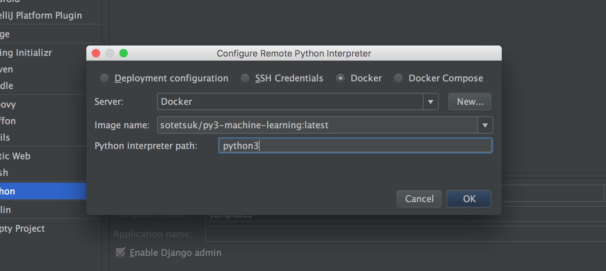

[](https://github.com/sotetsuk/docker-py3-machine-learning/releases)
[](https://hub.docker.com/r/sotetsuk/py3-machine-learning/)
[](https://github.com/sotetsuk/docker-py3-machine-learning/blob/master/LICENSE)

# Docker image for reproducible machine learning in Python3
Have you ever been bothered by building machine learning environments?
This docker image is for you! 
Let's enjoy machine learning in the reproducible enviromnent easily.

## Features

- Ensure reproducibility by full version spesification
- Based on Anaconda (4.2.0) enviroments

## Installed Packages

- numpy 1.11.1
- scipy 0.18.1
- scikit-learn 0.17.1
- pandas 0.18.1
- matplotlib 1.5.3
- and so on.

See [package_list.txt](package_list.txt) for details.

## Usage

```sh
$ docker pull sotetsuk/py3-machine-learning
```

### Run interactively

```sh
$ docker run -it sotetsuk/py3-machine-learning
```

### Run Jupyter Notebook

```
$ docker -d -p 8888:8888 sotetsuk/py3-machine-learning /run_jupyter.sh
```

with sharing current directory:

```
docker run -v $(pwd):/work -d -p 8888:8888 sotetsuk/py3-machine-learning /run_jupyter.sh
```

### Run as IntelliJ (PyCharm) interpreter

1. Install **Python** and **Docker integration** plugins.
2. Follow these steps:
  - **[Create New Project]**
  - **[Python]**
  - Python SDK **[NEW]**
  - **[Add Remote]**
  - Finally, 
    - Check **[Docker]**
    - Server: **[New]** => **[OK]** (change nothing)
    - Image name: **sotetsuk/py3-machine-learning:latest** (or another version)
    - Python interpreter path: **python3**

<p align="center">

</p>

## Versioning
- MAJOR: Some imcompatible change
- MINOR: Update versions of some packages
- PATCH: Add other packages

## How to contribute
Any contribution is more than welcome! Fork the repo and send PR!

## LICENSE
MIT
